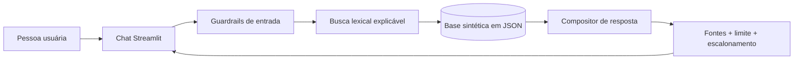

# 🛡️ ConformidadePay — Assistente de Compliance para Pagamentos

Protótipo educacional de um assistente virtual que ajuda profissionais do mercado de pagamentos a compreender controles de conformidade aplicáveis a uma operação de credenciamento e subcredenciamento.

O projeto foi desenvolvido para o Lab **Construa Seu Assistente Virtual Com Inteligência Artificial**, da DIO, e percorre as seis etapas propostas: documentação, base de conhecimento, prompts, aplicação funcional, avaliação e pitch.

> **Importante:** o conteúdo é geral, sintético e baseado em referências públicas. Não contém documentos corporativos, dados pessoais, casos reais, segredos comerciais nem procedimentos internos de qualquer organização. As respostas não são parecer jurídico ou regulatório.

## Problema e solução

No ecossistema de pagamentos, dúvidas sobre cadastro, PLD/FT, privacidade, fraude, recebíveis e segurança aparecem no trabalho diário. A informação costuma estar distribuída, enquanto uma resposta apressada pode criar risco.

O ConformidadePay oferece uma primeira orientação segura:

- encontra o tema mais relacionado à pergunta;
- responde somente com trechos estruturados da base aprovada;
- informa sinais de atenção e quando escalar;
- aponta referências públicas;
- recusa segredos, dados pessoais e tentativas de burlar suas regras;
- admite quando não possui evidência suficiente.

## Demonstração rápida

Pergunte: **Quais cuidados devo tomar antes de credenciar um estabelecimento?**

O agente retorna contexto, ações recomendadas, sinais de alerta, critérios de escalonamento e fontes. Se a pergunta pedir uma alçada interna exata ou trouxer dados sensíveis, ele não inventa a resposta e direciona para validação humana.

## Arquitetura



O núcleo funciona localmente e de forma determinística. Essa escolha permite demonstrar grounding e anti-alucinação sem exigir chave de API ou enviar conteúdo a terceiros. Uma LLM pode ser adicionada futuramente apenas para reformulação, mantendo a recuperação e as validações como fonte de verdade.

## Como executar

Requisitos: Python 3.10 ou superior.

```bash
python -m venv .venv
# Windows: .venv\Scripts\activate
# Linux/macOS: source .venv/bin/activate
python -m pip install -r src/requirements.txt
python -m streamlit run src/app.py
```

Para executar os testes, sem dependências externas:

```bash
python -m unittest discover -s tests -v
```

## Estrutura

```text
data/
  base_conhecimento.json   # conteúdo sintético usado nas respostas
  fontes_publicas.json     # referências oficiais e data de consulta
docs/                      # documentação das seis etapas
src/
  app.py                   # interface Streamlit
  assistente.py            # recuperação, composição e guardrails
tests/
  test_assistente.py
```

## Escopo da base

Ética e integridade; KYC/KYB e diligência; PLD/FT; credenciamento; fraude e chargeback; recebíveis; privacidade; segurança; continuidade; e desenvolvimento seguro.

## Segurança e privacidade por desenho

- Base pública e sintética, sem indexação de documentos internos;
- nenhuma credencial ou chave de API;
- processamento local no protótipo;
- respostas limitadas ao conteúdo recuperado;
- recusa de solicitações sensíveis e de prompt injection;
- escalonamento explícito para Compliance, Jurídico, Privacidade ou Segurança;
- aviso constante de que a aplicabilidade depende do caso concreto.

## Referências públicas principais

- [Lei nº 12.865/2013 — arranjos e instituições de pagamento](https://www.planalto.gov.br/ccivil_03/_ato2011-2014/2013/lei/l12865.htm)
- [Lei nº 9.613/1998 — prevenção à lavagem de dinheiro](https://www.planalto.gov.br/ccivil_03/leis/l9613.htm)
- [Circular BCB nº 3.978/2020 — PLD/FT](https://www.bcb.gov.br/estabilidadefinanceira/exibenormativo?tipo=Circular&numero=3978)
- [Lei nº 13.709/2018 — LGPD](https://www.planalto.gov.br/ccivil_03/_ato2015-2018/2018/lei/l13709.htm)
- [Resolução CD/ANPD nº 15/2024 — incidentes de segurança](https://www.gov.br/anpd/pt-br/assuntos/noticias/anpd-aprova-o-regulamento-de-comunicacao-de-incidente-de-seguranca)
- [Lei nº 12.846/2013 — anticorrupção](https://www.planalto.gov.br/ccivil_03/_ato2011-2014/2013/lei/l12846.htm)

Consulte a vigência e a aplicabilidade antes de usar qualquer referência em uma decisão real.

## Próximos passos

- revisão por especialista independente;
- busca semântica com citação por trecho;
- autenticação e perfis de acesso;
- avaliação com 3 a 5 profissionais e publicação das notas consolidadas;
- integração opcional com LLM sob controles de privacidade adequados.

## Autoria

Projeto de portfólio desenvolvido por **Lucas Mendes** para o Bootcamp DIO.
